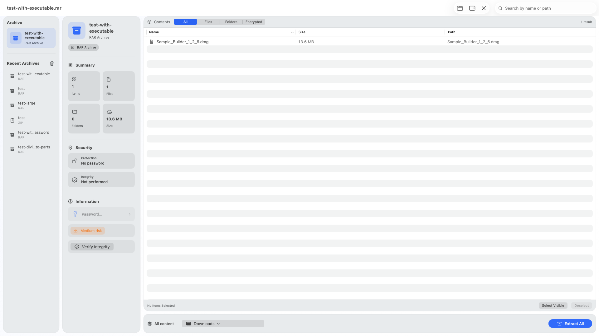
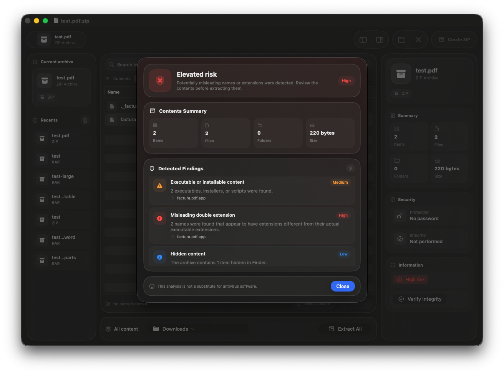
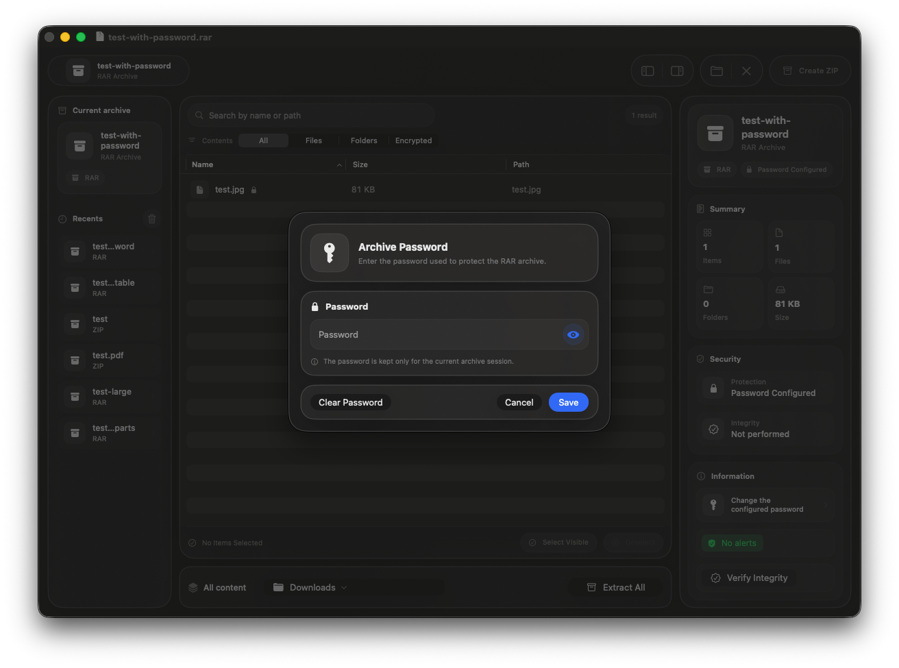
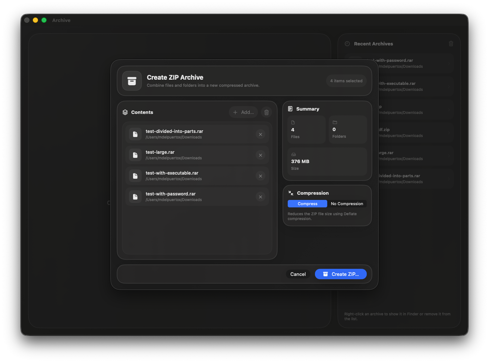

# Archive

**A native archive utility for macOS.**

Archive is a native macOS application for opening, inspecting, extracting, and creating compressed archives, designed to feel at home on macOS.

Archive currently supports **RAR and ZIP archives**, including password-protected RAR files, selective extraction, archive inspection, integrity verification, risk analysis, ZIP creation, and additional extraction safeguards.

## Preview

## Screenshots

### Integrity & Security

### Password-Protected Archives

### Archive Creation

## Features

### Archive Browsing

- Open and inspect RAR and ZIP archives
- Drag and drop support
- Password-protected RAR archive support
- Search, filtering, and sorting
- Selective extraction of files and folders
- Recent archives for quick access
- Archive information and integrity details

### Extraction

- Configurable extraction destination
- Extraction progress
- Extraction cancellation
- Native Finder integration
- Optional macOS notifications

### Archive Creation

- Create ZIP archives from files and folders
- Configurable archive destination
- Compression progress
- Cancellation support
- Input and destination validation

### Security & Safety

Archive includes multiple safeguards designed to make archive handling and extraction safer:

- Archive integrity verification
- Archive risk analysis with visual risk indicators
- Secure extraction staging
- Path traversal protection
- Post-extraction validation
- Extraction size and resource limits
- Available disk-space validation
- Quarantine handling
- Extraction destination validation
- Password-attempt protection with temporary lockout after repeated incorrect attempts
- Optional protection against displaying the contents of password-protected archives before authentication

### macOS Experience

- Native SwiftUI interface
- Drag-and-drop workflows
- Finder integration
- Native notifications
- Apple Silicon and Intel support
- Localization in multiple languages

## Requirements

- macOS 14.6 or later
- Apple Silicon or Intel Mac

## Downloads

The latest version of Archive is available from **GitHub Releases**.

Download the macOS universal DMG and drag **Archive** to your **Applications** folder.

> Archive is currently distributed without Apple Developer ID signing or notarization. macOS may require you to allow the application manually from **System Settings → Privacy & Security** the first time it is opened.

Only download Archive from this official GitHub repository.

## Roadmap

Archive will continue to expand beyond its current RAR and ZIP capabilities.

Planned areas of development include:

- RAR archive creation, where technically and legally viable
- Support for additional popular archive formats
- Creation and compression using additional formats
- Quick file previews without extracting the entire archive
- Preview support for images, text, PDFs, and other compatible documents
- Improved archive browsing and navigation
- Additional archive metadata and technical information
- Expanded integrity verification and risk analysis
- Additional security safeguards
- Improved handling of large archives
- Faster archive opening and content loading
- Performance and memory usage improvements
- Additional compression and extraction options
- Improved archive creation workflows
- Additional Finder and macOS integration
- Continued macOS interface refinements
- Expanded localization and accessibility support

The roadmap may evolve as Archive develops, and planned functionality is not guaranteed to appear in a specific release.

## Development Status

Archive **0.1.0** is the first stable public release.

Development continues with a focus on additional archive formats, preview capabilities, archive creation, security, performance, and deeper macOS integration.

## Source Code

Archive is proprietary software.

The source code and Xcode project are maintained in a private repository and are not distributed as part of this public repository.

This repository is intended for project information, documentation, screenshots, release notes, and official software distribution.

## Third-Party Software

Archive uses third-party components, including **UnRAR** and **ZIPFoundation**.

Those components remain subject to their respective copyright notices and license terms.

## Copyright

Copyright © 2026 Luca Sterling. All rights reserved.

Archive is proprietary software. The source code and Xcode project are not distributed through this repository.

Unless otherwise stated, the contents of this repository may not be copied, modified, redistributed, or used for commercial purposes without written permission from the copyright holder.

Third-party software used by Archive remains subject to its respective licenses and copyright terms.
